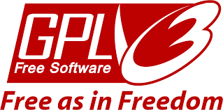
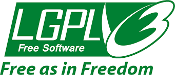

# 오픈소스의 소개 2

## 1. 오픈소스 성공 사례

###  1\) 각 분야 별 오픈소스 적용 성공 사례

       \(1\) 넥슨: IT 시스템 관리/모니터링/운영 \(정보 시스템 분야\)

  

       \(2\) 한양대학교: 모바일 스마트 캠퍼스 \(모바일 분야\)

  

       \(3\) GS샵: 오픈소스 기반 상품 추천 시스템 \(클라우드&빅데이터 분야\)  

       \(4\) 핸드스튜디오: 오픈소스 기반 스마트 TV 앱 \(임베디드 분야\)

  

## 2. 오픈소스 기반 아키텍처

###  1\) 전략 및 계회 부분은 상업용 소프트웨어 아키텍처를 따름

###  2\) 기술 및 구현 부분은 오픈소스 소프트웨어의 아키텍처를 차용

       \(1\) 사용자 및 시장의 요구 사항

       \(2\) 요구사항에 맞는 솔루션의 스펙을 정의하고 출시 일정, 타겟 고객 등을 결정

       \(3\) 제품 구현에 필요한 기반 오픈소스 기술과 컴포넌트를 선택하고 요구사항에 맞게 통합 \(패키지화\)

###  3\) 오픈소스 기반 솔루션 아키텍처 전략

        \(1\) 오픈소스에 부족한 제품 전략, 마케팅적인 부분을 회사가 가진 역량\(브랜드, 영업/기 술력 등\)을 통해 보완

        \(2\) 오픈소스를 통해 구현에 필요한 시간을 단축하고, 저변이 넓은 검증된 기술을 통해 솔 루션의 기반을 견고하게 함

        \(3\) 상용 솔루션이 필요로 하는 성능, 재사용성, 유연성 등을 쉽게 확보

        \(4\) 전략에 맞는 아키텍처를 수립하고 그에 맞는 오픈소스 컴포넌트들을 선택하여 패키지 화\(통합\)

###  4\) Hadoop 생태계의 개념과 성공 사례

: 하둡 생태계는 분산 프로그래밍 프레임워크를 이루고 있는 다양한 서브 프로젝트들의 모임이다.

####  \(1\) zookeeper

 : 분산 환경에서 서버들간에 상호 조정이 필요한 다양한 서비스를 제공하는 시스템입니다.

 첫째, 하나의 서버에만 서비스가 집중되지 않도록, 서비스를 알맞게 분산하여 동시에 처리하게 해줍니다.

 둘째, 하나의 서버에서 처리한 결과르 다른 서버들과도 동기화하여 데이터의 안정성을 보장해줍니다.

 셋째, 운영 서버가 문제가 발생하여 서비스를 제공할 수 없을 경우, 다른 대기 중인 서버를 운영서버로 바꿔서 서비스가 중지 없이 제공되게 해줍니다.

 넷째, 분산 환경을 구성하는 서버들의 환경설정을 통합적으로 관리해줍니다. \(공식 사이트: [http://zookeeper.apache.org/](http://zookeeper.apache.org/)\) 

 

####  \(2\) Hive

 : 하둡 기반의 데이터웨어하우징용 솔루션입니다. 페이스북에서 개발됐으며, 오픈 소스로 공개되며 주목을 받은 기술입니다.

 SQL과 매우 유사한 HiveQL이라는 쿼리를 제공합니다.

 그래서 자바를 모르는 데이터 분석가들도 쉽게 하둡 데이터를 분석할 수 있게 도와줍니다.

 HiveQL은 내부적으로 MapReduce 잡으로 변환되어 실행됩니다. \(공식 사이트: [http://hive.apache.org](http://hive.apache.org)\)

####  \(3\) Scribe

 : 페이스북에서 개발한 데이터 수집 플랫폼이며, 데이터를 중앙 집중 서버로 전송하는 방식입니다.

 최종 데이터는 HDFS외에 다양한 저장소를 활용할 수 있으며, 설치와 구성이 쉽게 다양한 프로그램 언어를 지원합니다.

 HDFS에 저장하기 위해서는 JNI\(Java Native Interface\)를 이용해야 합니다. \(공식 사이트: [https://github.com/facebook/scribe](https://github.com/facebook/scribe)\)

####  \(4\) Sqoop

 : 대용량 데이터 전송 솔루션이며, 올해 4월 아파치의 top-level 프로젝트가 됐습니다.

 Sqoop은 HDFS, RDBMS, DW, NoSQL등 다양한 저장소에 대용량 데이터를 신속하게 전송할 수 있는 방법을 제공합니다.

 Oracle, MS-SQL, DB2 등과 같은 상용 RDBMS와 MySQL, PostgresSQL과 같은 오픈소스 RDBMS등을 지원합니다. \(공식 사이트: [http://sqoop.apache.org](http://sqoop.apache.org)\)

## 3. 산업과 오픈소스의 결합

###  1\) 인더스트리 발전 과정

        \(1\) 1차 산업혁명 – 물과 증기로 가동되는 제조설비 도입

        \(2\) 2차 산업혁명 – 노동분업화에 따라 전기설비에 의한 대량생산시대로 진입

        \(3\) 3차 산업혁명 – 전자제품과 IT의 사용을 통한 제조업의 자동화 확산

        \(4\) 4차 산업혁명 - 사이버폴리시스템\(CPS\) 기반

###  2\) 인더스트리 4.0 \( 4차 산업혁명 \)

        \(1\) 2008년 금융 위기 이후, 선진국의 제조업 부활 정책 총공세 및 제조업의 중요성 재조명

        \(2\) ICT 기반 제 4차 산업혁명

        \(3\) 사물인터넷, 빅데이터, 클라우드컴퓨팅, 스마트로봇 등 기반 기술의 동시다발적 발전

        \(4\) 제조 생태계와 초 연결 사회 간의 실시간 연계, 소통이 가능

        \(5\) 제조 강국의 세대교체 가속화, 상품 수출과 기술 서비스 접목 활성화

              &gt;&gt; 오픈소스 기반 ICT 기술을 통한 산업의 발전

###  3\) 오픈소스 산업계 적용 예 – Polarsys

        \(1\) Airbus와 Eclipse Foundation이 주도가 되어 안전과 관련된 산업 기기, 임베디드 소프 트웨어 시스템을 오픈소스 기반으로 개발하기 위한 프로젝트

        \(2\) 항공, 국방, 운송, 통신, 에너지, 의료 등에서 필요로 하는 개발 도구

        \(3\) 국제적인 규제에 근거하여 요구사항 수집부터 개발, 테스트까지 제품에 대한 전체적인 lifecycle을 관리할 수 있는 도구

        \(4\) 30 ~ 70년 유지보수가 가능해야 하므로 개방형 오픈소스 소프트웨어가 필요

        \(5\) 국내는 원천 기술보다는 활용/생산/설비 기술에 강하므로 서비스로 발전 필요성

## 4. 접근 방법 및 프로세스

### 1\) 오픈소스 참여 모델

: 개발자 - 커뮤니티 - 사용자 - 잠재적 사용자

### 2\) 오픈소스 적용 모델

        \(1\) OSS의 강자들은 활용 단위에 따라 다양한 방법으로 사업 경쟁력을 강화시킴

        \(2\) 상용 SW와 OSS의 분류 체계는 유사하며, 완제품 수준의 대체와 연계가 핵심임

        \(3\) 라이선스 이슈는 보통 소스 코드와 라이브러리 수준에서 결합 형태에 따라 달라짐

### 3\) 오픈소스 프로젝트 찾기

       \(1\) 오픈소스 소스 저장소\(Repository\)

 : Github, BitBucket, Google Code, Code Project, SourceForge, Naver nForge

### 4\) 오픈소스 소프트웨어 개발 방법론

        \(1\) 공동개발 방식으로 소프트웨어 개발

        \(2\) 하나의 프로젝트 혹은 소프트웨어를 전세계에 흩어져 있는 다양한 사람들과 조직이 어우 러져서 개발을 진행하는 방식

        \(3\) 공통관심사를 갖는 사람들이 함께 특정 소프트웨어나 프로젝트를 개발하는 관계로자사의 개발과 투자 비용을 절감하고, 기업 외부의 인력과 기술을 내재화할 수 있는 특성이 있음

        \(4\) 외부 인력과 기술을 활용하여 개발 비용을 절감하기 위해서는 ,해당 기술을 이해하는 많은 외부 인력이 존재하고 이들이 오픈 소스 소프트웨어를 통해 자신의 기술과 능력을 공유할 정도의 환경과 규모가 필요

        \(5\) 공동 개발 방식은 소위 네트워크 효과에 의해 크게 영향을 받는 개발 방식으로 특정 임 계점 이상의 개발자가 소프트웨어 개발에 참여해야만 성공적으로 소프트웨어가 유지, 관리, 개발되는 특성이 있음.

### 5\) Subversion 작업유형

####  : 중앙 저장소 내에서 로컬 복사 후 변경한 사본을 커밋하는 방식으로 진행

        \(1\) 로컬  복사본 만들기

        \(2\) 변경 및 수정

        \(3\) 변경사항 확인

        \(4\) 로컬 복사본 업데이트

        \(5\) 충돌 해결\(변경 내용 관리\)

        \(6\) 변경 내용 제출

### 6\) Git 작업 유형

        \(1\) 기존의 버전 관리 시스템과는 다른 로컬 영역의 저장소의 2단계를 가짐

        \(2\) 명령어들을 로컬에서 실시하고 나중에 서버에 올리는 방식을 사용

        \(3\) 기존의 svn에서 commit이 소스를 수정하고, 저장소로 업로드하는 단계를 각각의 명령 어로 분리하여 중간에 로컬에서 일하다가 저장소에 적용하기 전의 잠재적인 한 번의 단 계를 거침

        \(4\) 한 번의 명령으로 바로 적용되는 SVN과는 달리 2번의 명령을 실행해야 마침내 서버에 있는 저장소로 업로드

        \(5\) “git commit –a”의 명령을 통해서 다른 버전관리 프로그램들과 같이 이용하는 것도 가능

### 7\) Git 기반 분산형 개발 아키텍처

        \(1\) 각 팀원의 역할을 분담해서 한 명은 통합을 전담으로 수행

        \(2\) 다른 개발자는 각자 부분 개발에 집중을 하는 식으로 역할 분담

        \(3\) 팀이 커질수록 복수의 repository를 쉽게 구성 가능

        \(4\) 하위 팀들을 묶어주는 통합 관리자, 그리고 전체를 통합하는 관리자로 더 세분화해서 구성하는 것이 가능

## 5. 오픈소스 고려 사항

### 1\) 오픈소스 라이선스 – OSI 인증 70여 개 라이선스

### 2\) 오픈소스 라이선스 – 특징\(양면성\)

####         \(1\) 자유 : 복제, 설치, 운영, 수정, 배포의 자유

        1.기존 소스 코드 및 라이브러리의 재사용으로 생산성 향상

        2. 성숙한 OSS 커뮤니티의 프로젝트 적용으로 품질 보장

####         \(2\) Copyleft : 공개되어 있는 소스 코드

        1. 공개되어 있는 소스 코드를 통해 알고리즘과 로직을 분석하고 응용할 수 있어 설계자, 개발자, 테스터의 소프트웨어 기술력 증강

####         \(3\) 무료 : 내부 사용, 외부 판매

        1. TCO\(Total Cost Ownership\) 절감

        2. 기술지원 및 유지보수 서비스를 기반으로 사업 가능

####         \(4\) 반환 의무 : 특정 OSS, 라이선스의 소스 코드 공개 의무

        1. GPL, LGPL, MPL, CPL, IBM, EPL, OSL, Qt 등이 해당됨

        2. 연결된 소프트웨어의 소스 코드 공개의무가 발생

        3. 비공개 SW가 OSS로 변경될 수 있음

        4. 특허, 영업비밀, 핵심기술 등의 외부 유출 가능성 존재

####         \(5\) 저작권 : 저작권법에 따른 법적 권리 보장

        1. OSS 라이선스 미 준수 시 저작자와 분쟁 가능

        2. 협력업체가 저작권 위반 시 협력업체가 책임을 지더라도 최종적으로 고객이 동의하지 않는 소스 코드 공개 등은 공급사의 부담이 됨

### 3\) 오픈소스 라이선스 및 의무사항

:주요 OSS 라이선스인 GPL, LGPL, CPL, MPL 등은 OSS 코드 뿐 아니라 사용자 코드 공개의무 발생

OSS를 활용하면서 공개하기 어려운 코드를 보호하기 위해서는 적절한 라이선스 관리가 필요함

####        1. GPL \( General Public License \)

        \(1\) 자유로운 사용, 복제 , 배포 및 수정

        \(2\) 저작권 표시, 보증책임이 없다는 표시, GPL 명시

        \(3\) 소프트웨어 수정 및 링크 시 모든 코드를 GPL에 의해 공개

####        2. LGPL \( Lesser General Public License \)

       \(1\) 자유로운 사용, 복제, 배포 및 수정

       \(2\) 저작권 표시, 보증책임이 없다는 표시, LGPL 명시

       \(3\) 소프트웨어 수정 및 링크 시 모든 코드를 LGPL에 의해 공개

        \(단, 라이브러리 링크 시 공개하지 않음\)

####        3. MPL \( Mozilla Public License \)

        \(1\) 자유로운 사용, 복제 , 배포 및 수정

        \(2\) 저작권 표시, 보증책임이 없다는 표시, MPL 명시

        \(3\) 특허 보복조항\(특허 SW 사용시 특허권을 주장할 수 없음\)

        \(4\) 소프트웨어 수정 및 링크 시 해당 파일을 공개

####        4. EPL\( Eclipse Public License \)

        \(1\) 자유로운 사용, 복제, 배포 및 수정

        \(2\) 저작권 표시, 보증책임이 없다는 표시, EPL 명시

        \(3\) 특허 보복조항\(특허 SW 사용시 특허권을 주장할 수 없음\)

        \(4\) 소프트웨어 수정 및 링크 시 해당 파일을 공개

### 4\) 오픈소스 전환 Best Practice

        \(1\) 라이브러리 교체가 프레임워크 교체에 비해 쉬움

        \(2\) 운영 체제, 관리/모니터링 컴포넌트 적용 용이

        \(3\) 미들웨어\(웹서버, 앱서버, Queue 등\) 교체가 DB 교체에 비해 쉬움

        \(4\) 데이터 저장, 처리 등 전문/업무 영역은 범용적인 분야에 비해 부족

        \(5\) 사실상의 표준에 가까운 인지도 높은 오픈 소스 활용

        \(6\) 유연성과 민첩성 확보를 위한 범용적인 아키텍처의 중요성

        \(7\) TCO 절감 및 ROI 극대화를 위한 내재화가 필수 오픈소스 전환 Best Practice

### 5\) 오픈소스에 대한 부정적인 의견

        \(1\) 상용 소프트웨어를 선택하는 것이 유리한 경우

        \(2\) 상용의 사용 방법이 훨씬 쉬운 경우

        \(3\) 상용이 사실상의 표준인 경우

        \(4\) 상용의 지원이 우수하거나 기능이 더 풍부한 경우

        \(5\) SaaS 기반 서비스가 필요할 때

        \(6\) 하드웨어 호환성이 우수한 경우\(예: Window XP HW Driver 지원\)

        \(7\) 보증/책임보상이 중요한 경우

        \(8\) 경우에 따른 선택이 중요

        \(9\) 기능이나 호환성 같은 명확히 우수한 요건의 경우에는 상용 선택이 유리

        \(10\) 지원과 같은 비기능적인 요건의 경우에는 소스가 공개된 오픈소스가 유리할 수도 있음

                &gt;&gt; 위와 같은 이유로 80 %는 오픈소스의 품질이 상용 제품보다 나은 것으로 평가

### 6\) 오픈소스의 보안

        \(1\) Linux가 타 플랫폼에 비해서 안정적이라는 보고

        \(2\) 제로데이어택\(아직 밝혀지지 않은 버그를 이용한 공격\) 시대라는 관점에서, 공개된 소스 를 통해 문제점을 빨리 찾을 수 있는 오픈소스가 보안성 높음\(Gartner\)

        \(3\) 소스가 공개되어 있어 투명하고 문제점 발견 시, 소수에 의해 주도되는 프로젝트에 비해 빠르게 해결 가능 오픈소스의 보안

## 6. 결론

###  1\) 강점 요소

        \(1\) 전세계의 다양하고 많은 기업들이 기술 개밤에 참여

        \(2\) X86 시스템과 함께 높은 기술 경쟁력 및 시장 점유율 보유

        \(3\) 가상화/클라우드 컴퓨팅 기반 기술을 제공하며 시스템 혁신 가능

        \(4\) 국내외 기술지원 전문기업과 엔지니어가 많아지고 있음

###  2\) 약점 요소

        \(1\) 오픈 소스에 대한 이해도, 생태계, 개발 프로세스 등에 대한 인식이 부족

        \(2\) 정보 기획/ 운영 관점의 투자\(초기교육, 컨설팅\)가 필요한 분야

        \(3\) 복잡한 라이선스 모델

### 3\) 기회요소

        \(1\) 핵심 기술에 대한 기술력\(내재화\)를 통한 경쟁사 우위

        \(2\) 모바일/클라우드/IOT 등 다양한 분야에 대한 빠른 시장 접근

        \(3\) 기술 도입 및 운용 비용의 절감

### 4\) 위협요소

 \(1\) 상용SW 벤더의 라이선스 관리 서비스\(LMS\)를 통해 법적 이슈를 만들어 지속적으로 Lock-in 시킴

 \(2\) 기존의 IT 환경에 익숙한 관리자들의 반발

 \(3\) 자체 기술력 부족 시 비용 절감 효과가 낮음

### 5\) 오픈소스의 의미

        \(1\) 개방형 기술을 통한 사실상의 표준 주도

        \(2\) 오픈소스를 활용한 기술과 서비스의 분리

        \(3\) 오픈소스는 시대적 흐름

## 7. 참고 문헌

위키피디아

• [https://ko.wikipedia.org/wiki/%EC%98%A4%ED%94%88\_%EC%86%8C%EC%8A%A4](https://ko.wikipedia.org/wiki/%EC%98%A4%ED%94%88_%EC%86%8C%EC%8A%A4)

OSI

• [https://opensource.org/osd](https://opensource.org/osd)

블랙덕

• 2014 Future of Open Source Survey Results

• 2015 Future of Open Source Survey Results

IDC

• Worldwide Linux Server Operation System Environment by Vendors, 2006-2010, March IDC 2011

IT World

• [http://www.itworld.co.kr/news/97250](http://www.itworld.co.kr/news/97250)

Yahoo Finance

• [http://finance.yahoo.com](http://finance.yahoo.com)

NIPA/MASO

• 공개SW 성공 사례집

Polarsys

• [https://www.polarsys.org/](https://www.polarsys.org/)

