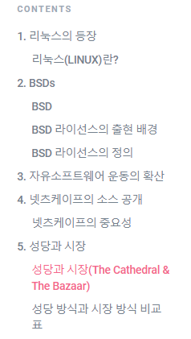

# 읽어주세요

페이지 생성 시 영어 단어로 생성 -&gt; 한글로 수정하기\(이렇게 안하면 github에서 파일명이 untitled로 떠요ㅠ\)

## 페이지 내부 문법

이렇게 목차가 페이지 옆에 뜰 수 있도록 \# 1.리눅스의 등장 \#\# 리눅스란 이런식으로 만들어주세요

넘버링이 필요한경우 

1. 

1\)

\(1\) 

이 순서로 만들어주세요!

## 참고문헌

참고문헌 링크 및 문서명 양식에 맞춰 참고문헌 페이지에 추가해주세요

